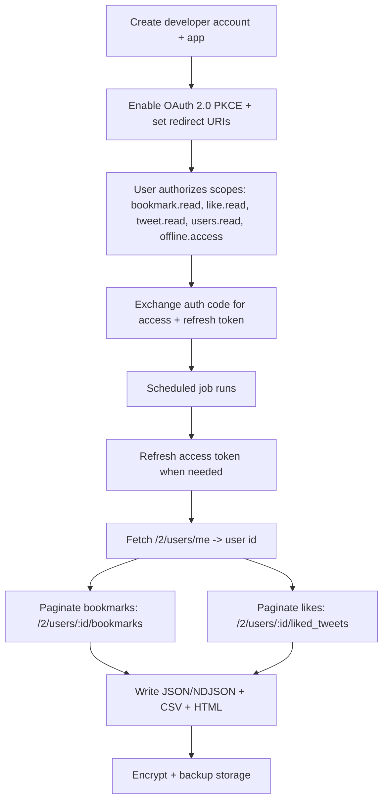
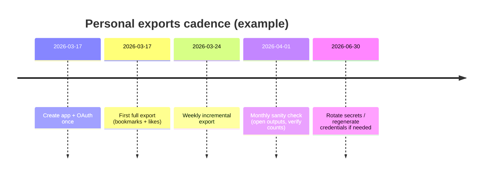

https://chatgpt.com/c/69b4e396-7ae4-83a3-aee1-17ea240211a1

# Regular Personal Exports of X Bookmarks and Likes: Current Best Options

## Executive summary

Exporting your own **Likes** and **Bookmarks** from X meaningfully differs in “officialness,” cost, and automation potential.

The most defensible, automation-friendly approach is **using the official X API v2**: **Bookmarks** are available via the Bookmarks endpoints (including folders) and **Likes** via the “liked posts” endpoint, with OAuth-based authentication and published per-endpoint rate limits. citeturn11view2turn11view1turn34view0turn32view0 The trade‑off is that X’s current pricing model is **credit-based pay‑per‑usage**, with per-endpoint costs shown in the developer console (not publicly enumerated in the docs page) and a **monthly cap** on pay‑per‑use “Post reads.” citeturn30view0

The only fully official “end user” export that does not require developer credentials is **Download an archive of your data**. That archive is easy for Likes (commonly present as `data/like.js` in the archive structure), but it does **not** include Bookmarks (per third‑party inspection and long‑standing community expectation; X’s help article does not claim bookmarks are included). citeturn7search11turn9view0

A large ecosystem of open-source tools exists which can export Bookmarks and/or Likes without paying for the official API by relying on in-browser capture or internal web APIs (commonly described as “internal GraphQL” or other “semi-secret” endpoints). Examples: **TweetHoarder** (active March 2026) and **twitter-web-exporter** (active March 2026). citeturn17view0turn20view0turn24view0turn21view0turn24view1 The critical downside is **policy and account-risk**: X’s Terms of Service state you cannot scrape the services without express written permission and must use published interfaces; X’s Developer Agreement also restricts reverse engineering and attempts to circumvent limits or unauthorized access. citeturn13view0turn14view0

User platform is **unspecified** (OS, browser, and whether you can run scheduled jobs). Where platform matters, this report provides OS-agnostic options and notes alternatives.

## Scope and evaluation approach

This report focuses on “end user, personal exports on a recurring basis” and evaluates options across: official availability, authentication complexity, automation/scheduling feasibility, realistic reliability, cost exposure, and security/privacy concerns.

Primary references were X’s official documentation for endpoints, OAuth flows, pricing model, and rate limits, plus upstream open-source repositories and their observable maintenance signals (commit history, release recency, and language breakdown). citeturn34view0turn30view0turn16view2turn16view1turn21view0turn20view0turn24view1turn24view0

## Official options and what they can export

### Official end-user data archive

X provides an end-user workflow to **request and download an archive of your data** from settings (“Download an archive of your data”), with steps documented for web and mobile. citeturn7search11

In practice, the archive format is commonly a local HTML viewer (`Your archive.html`) plus a `data/` directory containing `.js` files, which are “JSON-like” JavaScript assignments (e.g., the manifest assigns into `window.__THAR_CONFIG`). citeturn9view0 A concrete archive inspection example shows a `data/like.js` item and demonstrates that Likes can be extracted and analyzed from that file. citeturn9view0 The same inspection explicitly notes that **Bookmarks are not part of the archive**. citeturn9view0

Implications for regular exports:
- **Likes:** exportable via periodic archive downloads, but **not ideal for frequent automation** because the archive is requested interactively and asynchronously (you wait for the archive to be prepared). citeturn7search11turn9view0
- **Bookmarks:** not covered by this official archive (per third-party inspection); you need API or non-official approaches for a reliable bookmarks export. citeturn9view0

### Official X API v2 endpoints for Bookmarks and Likes

X’s official docs define Bookmarks as private and only visible to the user who created them, and provide endpoints to view, add, and remove bookmarks (including folder endpoints). citeturn11view2turn34view0

The core endpoints relevant to exporting:

**Bookmarks**
- `GET /2/users/:id/bookmarks` (retrieve bookmarks). citeturn11view2turn32view1turn34view0  
- Folder-related reads: `GET /2/users/:id/bookmarks/folders` and `GET /2/users/:id/bookmarks/folders/:folder_id`. citeturn11view2turn34view0  
- Pagination: `pagination_token` (documented as a base36 token) and `max_results` up to 100. citeturn11view0turn32view1  
- Identity constraint: the `id` path parameter is described as the authenticated source user and must match the authenticated user. citeturn11view0  

**Likes**
- `GET /2/users/:id/liked_tweets` (retrieve posts liked by a user). citeturn11view1turn32view0turn34view0  
- Pagination: `pagination_token` (base36 token) and `max_results` range includes up to 100. citeturn11view1  

**Rate limits (published, per endpoint)**
- Likes lookup: `GET /2/users/:id/liked_tweets` **75/15min per app** and **75/15min per user**. citeturn34view0  
- Bookmarks lookup: `GET /2/users/:id/bookmarks` **180/15min per user** (no per-app rate shown in the table for that row). Folder reads are **50/15min** per app and per user. citeturn34view0  

These published rate limits are typically sufficient for personal exports unless you have extremely large archives and request maximal expansions frequently. citeturn34view0

### Official API pricing and “is free personal export possible”

X’s docs describe the current model as **pay‑per‑usage** with **credits purchased upfront**, and emphasize the model is **per-endpoint priced** with rates shown in the developer console. citeturn30view0 The same page states **no contracts/subscriptions/minimum spend** for pay‑per‑use (while noting legacy subscriptions can opt into pay‑per‑use). citeturn30view0

The docs also state:
- **Deduplication** within a 24‑hour UTC window for billable resources is intended to avoid repeated charging for the same resource within the day, described as a “soft guarantee.” citeturn30view0  
- Pay‑per‑use plans have a **monthly cap of 2 million Post reads**; higher volume requires enterprise. citeturn30view0  

Because the official pricing documentation points to paid credits and does not describe a “free personal export tier” for Bookmarks/Likes exports, you should assume that **official API-based regular exports require a developer account and may incur charges** (even if modest for personal volumes). citeturn30view0

### Comparative table of official options

| Name | Repo URL | Last update | Auth required | Export types supported | Ease of use | Reliability | Cost |
|---|---|---:|---|---|---|---|---|
| X “Download an archive of your data” | `N/A` | Ongoing help article | X login + password/2FA | Likes (via archive files), other account data; Bookmarks not evidenced | High (guided UI) | High | Free |
| X API v2 Bookmarks endpoints | `N/A` | Ongoing docs | Developer account + OAuth user tokens | Bookmarks (+ folders) in JSON API responses | Medium | High (official API) | Pay‑per‑usage credits |
| X API v2 Likes endpoint (`liked_tweets`) | `N/A` | Ongoing docs | Developer account; OAuth or bearer depending on use | Likes in JSON API responses | Medium | High (official API) | Pay‑per‑usage credits |

The archive workflow and steps are documented by X’s help center. citeturn7search11 The Bookmarks endpoints, prerequisites, and examples are documented in X API docs. citeturn11view2turn32view1 Pricing model details come from the official pricing page. citeturn30view0

## Authentication flows and how to obtain credentials

### Credential types and when each matters

X’s “Apps” documentation describes apps as containers for API credentials and lists credential types generated during app creation: API key/secret and access token/secret (OAuth 1.0a), client ID/secret (OAuth 2.0), and bearer token for app-only public access. It recommends OAuth 2.0 for new projects and notes v2 user-context endpoints require OAuth 2.0. citeturn16view0

For exporting **your own Bookmarks**, you should plan for **OAuth 2.0 Authorization Code Flow with PKCE** (user-context tokens). X’s Bookmarks documentation explicitly calls for user access tokens via OAuth 2.0 PKCE or 3‑legged OAuth. citeturn11view2turn32view1

For exporting **your Likes**, `GET /2/users/:id/liked_tweets` supports user-context with scopes including `like.read` per the authentication mapping guide, and is also marked as accessible via app-only bearer for eligible data. For consistent “export my whole set,” user-context is the safer default. citeturn32view0turn16view1

### Step-by-step: obtaining an official developer app and credentials

The official “Getting Access” guide describes three main steps (developer account → app → save credentials). citeturn16view1 The “Apps” guide adds more detail about credential types and callback URL rules. citeturn16view0

A practical step sequence for an end user (with unspecified platform) is:

1. **Create a developer account**
   - Go to the developer console and sign in with your X account. citeturn16view1  
   - Review and accept the Developer Agreement and Policy as part of signup. citeturn16view1turn14view0  
   - Complete the profile / intended usage information. citeturn16view1  

2. **Create an app**
   - From the developer console dashboard, create a new app and enter name/description/use case. citeturn16view1turn16view0  
   - Generate the necessary credentials and **store them immediately** because they’re only shown once. citeturn16view0turn16view1  

3. **Enable OAuth 2.0 and configure callback URLs**
   - OAuth 2.0 must be enabled in the app’s authentication settings in the developer console. citeturn16view2turn16view0  
   - Register callback URLs (redirect URIs). X requires exact matching and documents limits (e.g., up to 10 callback URLs per app), plus guidance to prefer `127.0.0.1` for local development rather than `localhost`. citeturn16view0  

4. **Decide whether your app is “public client” (PKCE only) or “confidential client” (client secret)**
   - X documents app types and notes public clients use PKCE only while confidential clients receive a client secret. citeturn16view0turn16view2  
   - For a personal exporter running locally, a “Native App” style setup (public client) is common, though a server-based exporter can be treated as confidential. citeturn16view0turn16view2  

### OAuth 2.0 PKCE essentials for scheduled exports

**Token lifetimes and refresh**
- X states an OAuth 2.0 access token created via Authorization Code with PKCE is valid for **two hours by default**, unless you include `offline.access`. citeturn16view2  
- If `offline.access` is requested, X issues a refresh token and documents the refresh token flow through `POST https://api.x.com/2/oauth2/token` with `grant_type=refresh_token`. citeturn16view2  

**Scopes you need (Bookmarked Posts)**
X’s Bookmarks quickstart states that for PKCE you need `bookmark.read`, `tweet.read`, and `users.read` (the latter for expansions). citeturn32view1

**Scopes you need (Liked Posts)**
X’s v2 authentication mapping lists `GET /2/users/:id/liked_tweets` with scopes `tweet.read`, `users.read`, and `like.read`. citeturn32view0

### Why “session token extraction” is a risk area

Some non-official exporters rely on browser session data (cookies or internal web requests) instead of OAuth tokens. While this can avoid official API credits, it increases the risk profile.

Two separate official documents matter here:

- X’s Terms of Service summarize acceptable-use constraints and explicitly state you may not access the services other than through published interfaces, giving “cannot scrape the Services without X’s express written permission” as an example. citeturn13view0  
- X’s Developer Agreement restricts reverse engineering, interfering with monitoring mechanisms, attempting unauthorized access, and attempting to exceed or circumvent rate limits. citeturn14view0  

Because session tokens are effectively “keys to your account,” any workflow that asks you to extract/copy them materially increases account takeover and leakage risks (even if for your own use). The safest posture is: **prefer OAuth-based official access** when you want scheduled exports, and treat any cookie/session-based tool as higher-risk and potentially non-compliant.

## Open-source tools and repos for exporting Bookmarks and Likes

This section surveys open-source tooling found on entity["company","GitHub","code hosting platform"] and in browser extension ecosystems, with focus on export coverage, maintenance signals, and auth model.

### Comparison table of notable open-source tools

| Name | Repo URL | Last update | Auth required | Export types supported | Ease of use | Reliability | Cost |
|---|---|---:|---|---|---|---|---|
| TweetHoarder | `https://github.com/tfriedel/tweethoarder` | 2026-03-07 | Browser cookies / internal web API | Likes + Bookmarks; exports JSON/MD/CSV/HTML | Medium | Medium–High (active) | Free (higher ToS risk) |
| twitter-web-exporter | `https://github.com/prinsss/twitter-web-exporter` | 2026-03-07 | Logged-in browser (userscript capture) | Bookmarks (and more); JSON/CSV/HTML; media export | Medium | Medium–High (active) | Free (higher ToS risk) |
| Siftly | `https://github.com/viperrcrypto/Siftly` | 2026-03-11 | Logged-in browser export + local import | Bookmarks export to JSON for import | Medium | Medium (UI-dependent) | Free (higher ToS risk) |
| booksave (Firefox/Chrome extension) | `https://github.com/nedoxff/booksave` | 2024-10-27 | Browser extension (x.com + api.x.com permissions) | Bookmarks + Likes + own media | High | Medium | Free (higher ToS risk) |
| bookmark-export (Chrome extension) | `https://github.com/sahil-lalani/bookmark-export` | 2024-10-02 | Browser extension | Bookmarks → JSON | High | Medium | Free (higher ToS risk) |
| twitter-likes-exporter | `https://github.com/mlschmitt/twitter-likes-exporter` | 2023-01-23 | Logged-in session + internal GraphQL | Likes → local HTML (+ downloads) | Low–Medium | Low (unmaintained) | Free (higher ToS risk) |
| twitter-bookmark-archiver | `https://github.com/nornagon/twitter-bookmark-archiver` | 2022-11-28 | Developer app + local Node script | Bookmarks + media → HTML | Low | Low (old) | API credits likely |
| Twitter-Archive (jarulsamy) | `https://github.com/jarulsamy/Twitter-Archive` | 2022-08-26 | Developer app + OAuth | Bookmarks: manifest + media download | Medium | Low (old) | API credits likely |
| Twillot (archived) | `https://github.com/twillot-app/twillot` | Archived 2025-07-31 | Browser extension | Bookmarks export CSV/JSON; media download | Medium | Medium (archived) | Free |

Maintenance signals and core feature claims in this table come from upstream READMEs, release metadata, language breakdowns, and commit histories. citeturn17view0turn20view0turn24view0turn21view0turn24view1turn21view1turn24view2turn28view0turn29view0turn26view0turn17view2turn21view4turn17view3turn22view0turn25view1turn21view2turn25view0turn21view3turn19view3turn17view8

### TweetHoarder

**What it does.** TweetHoarder describes itself as a local archiver for “likes, bookmarks, tweets, reposts, and home feed,” storing data in a local SQLite database, exporting in multiple formats (JSON, Markdown, CSV, searchable HTML). citeturn17view0

**Auth model.** It explicitly uses **cookie-based authentication** to access the internal GraphQL API, claiming “no paid API key required.” citeturn17view0 In X policy terms, this is the riskiest approach category because it depends on internal interfaces rather than published APIs. citeturn13view0turn14view0

**Maintenance status.** Commit history shows commits as recent as **Mar 7, 2026**, indicating active maintenance at the time of research. citeturn20view0 The repository is overwhelmingly Python. citeturn24view0

**Pros/cons and security**
- Strengths: broad coverage (Bookmarks *and* Likes), local-first design, multiple export formats, and active development. citeturn17view0turn20view0  
- Weaknesses: requires high-privilege browser cookies; depends on internal web APIs that may change; higher chance of triggering enforcement; higher ToS/contract risk than official APIs. citeturn17view0turn13view0turn14view0  

**Recommended use (if you accept the risk):** run it in a dedicated browser profile and store outputs locally, backed up and encrypted; avoid sharing tokens or exporting them beyond the machine.

### twitter-web-exporter

**What it does.** This project exports “tweets, bookmarks, lists and much more” from the web app; it supports exporting captured data to JSON, CSV, and HTML, and can bulk export media to a zip archive. citeturn17view1

**Auth model.** It is a **userscript-style exporter** (repo topics include “userscript,” “tampermonkey,” and “violentmonkey”), meaning it runs inside a logged-in browser session and captures data as you browse. citeturn24view1

**Maintenance status.** Commit history shows commits on **Mar 7, 2026**. citeturn21view0 Release metadata shows **v1.4.0** released **Feb 25, 2026**. citeturn24view1 It is primarily TypeScript. citeturn24view1

**Pros/cons and security**
- Strengths: no developer credentials; “in browser” export; multiple formats; media export; active maintenance. citeturn17view1turn21view0  
- Weaknesses: depends on web app behavior and internal requests; likely ToS risk category (“scraping/crawling without consent”) even if it operates as “you browsing.” citeturn13view0turn14view0  
- Privacy: runs locally, but you still must trust the script’s code; you should inspect releases and use a minimal-permissions userscript manager.

### Siftly

**What it does.** Siftly is a local bookmark organizer that provides an export flow from the bookmarks page: via a bookmark-bar “Export X Bookmarks” link that auto-scrolls and then downloads `bookmarks.json`, or via a browser console script method. citeturn17view4

**Maintenance status and language.** Commit history shows activity on **Mar 11, 2026**. citeturn21view1 Release metadata indicates **v1.0.1** released **Mar 10, 2026**. citeturn24view2 It is primarily TypeScript. citeturn24view2

**Pros/cons and security**
- Strengths: designed around bookmarks organization and export; active maintenance. citeturn17view4turn21view1  
- Weaknesses: relies on in-page scripting and auto-scroll capture, which can break with UI changes; likely ToS risk category as it automates extraction via the web interface rather than published APIs. citeturn13view0turn14view0  

Given its explicit DevTools/script approach, you should treat it as a “manual, periodic export” mechanism rather than a fully unattended automation pipeline.

### booksave browser extension

**What it does.** The Firefox add-on listing describes “booksave” as a browser extension to export bookmarks, liked tweets, and your own media tweets, asserting it runs locally and sends nothing to a third-party server. citeturn26view0turn28view0

**Permissions and trust surface.** The add-on requests access to data on `x.com` and `api.x.com`, which is expected for exporters but still sensitive. citeturn26view0 The repo itself says it uses a “mix of semi-secret twitter APIs.” citeturn28view0

**Maintenance status and language.** Commit history shows last commits on **Oct 27, 2024**. citeturn29view0 Language breakdown shows TypeScript/Svelte as major components. citeturn28view0

**Pros/cons and security**
- Strengths: one of the few open-source browser tools explicitly claiming both Bookmarks and Likes export; local processing claim; easy install via browser add-ons. citeturn26view0turn28view0  
- Weaknesses: not recently updated (relative to 2026); depends on internal/undocumented endpoints; ToS risk category; extension permissions are powerful. citeturn29view0turn13view0turn14view0  

### bookmark-export Chrome extension

This lightweight Chrome extension repo documents a simple usage flow: click the extension, press “Export Bookmarks,” it opens the bookmarks page, waits, then downloads a JSON file of bookmarks. citeturn17view2 It is mostly JavaScript/HTML. citeturn24view4 Last commits are **Oct 2, 2024**. citeturn21view4

This is best seen as a quick manual exporter rather than a durable automation foundation, given limited maintenance signals and likely dependence on UI behavior.

### Older / likely unmaintained tools (use with caution)

These tools document flows but show no meaningful updates in years—important because X UI/internal APIs change frequently.

- **twitter-likes-exporter**: a set of Python scripts that scrape likes using the GraphQL API powering the website and convert to local HTML; the repo itself calls it “hacky” and indicates no intention of ongoing updates; last commits in **Jan 2023**. citeturn17view3turn22view0turn24view5  
- **twitter-bookmark-archiver**: Node-based bookmark exporter; instructions reference developer account creation and local run; last commits in **Nov 2022**. citeturn25view1turn21view2  
- **Twitter-Archive (jarulsamy)**: Python CLI that installs via `pip install twitter-archive`, asks you to create a developer application (client ID/secret), and downloads media from bookmarked tweets; last commits in **Aug 2022**. citeturn17view6turn21view3turn25view0  
- **Twillot**: a bookmark manager extension repo includes bookmark export to CSV/JSON and media download, but the repository is archived (read-only) as of **Jul 31, 2025**. citeturn19view3turn17view8turn25view2  

## Scraping and automation approaches

### Technical approaches seen in the ecosystem

Most non-official exporters fall into one of these patterns:

- **In-browser automation / capture**: Userscripts/extensions that auto-scroll the bookmarks/likes pages, intercept network responses, and then export JSON/CSV/HTML. Examples include exporters that explicitly discuss auto-scroll capture and downloaded JSON outputs. citeturn17view1turn17view4turn17view2  
- **Internal API calling with session cookies**: Tools that programmatically call internal endpoints (often described as “internal GraphQL” or “semi-secret APIs”) using authenticated cookies, and store results locally with export views. citeturn17view0turn17view3turn28view0  
- **Official API + OAuth**: Tools that implement OAuth and call published endpoints, often focusing on media download and manifest creation. citeturn17view6turn32view1turn11view2  

### Anti-bot and reliability issues

Even without discussing bypass tactics, reliability challenges are inherent:

- The service enforces **rate limits** and returns **429** on excess requests; X documents retry strategies and recommends monitoring `x-rate-limit-reset`. citeturn34view0  
- The web app and internal APIs change; tools with no recent commits tend to break. This is consistent with the wide date spread in commit recency across exporters (2022–2026). citeturn21view2turn21view0turn20view0  

### Legal and ToS risks

For personal exports, the key question is not “can it be done,” but “what’s the risk of enforcement or account impact.”

- X’s Terms of Service explicitly state that you may not access the Services other than via published interfaces and gives “cannot scrape without express written permission” as an example. citeturn13view0  
- X’s Developer Agreement prohibits reverse engineering and attempts to derive underlying APIs, and prohibits attempts to exceed or circumvent rate limits or gain unauthorized access. citeturn14view0  

This does not mean every automation will be enforced identically, but it does mean **cookie-based and internal-API exporters** are structurally higher risk than official API exports for a user who wants predictable recurring backups.

## Recommended workflows for regular automated exports

### Decision framework

If your goal is “regular, automatable, personal exports”:

- Choose **official API** when you want the best mix of reliability and compliance, and can accept pay‑per‑use credits. citeturn30view0turn34view0turn16view1  
- Choose **browser-based exporters** when you cannot (or will not) use developer credentials/credits, but accept higher fragility and higher policy risk. citeturn17view1turn17view2turn13view0turn14view0  
- Use **data archive** as a periodic “Likes backup of record,” not as an automation mechanism. citeturn7search11turn9view0  

### Official API export pipeline

#### Export endpoints and practical parameters

Bookmarks export loop:
- Get user id: `/2/users/me` (rate-limited at 75/15min per user). citeturn34view0turn32view1  
- Paginate bookmarks: `GET /2/users/{id}/bookmarks` with `max_results=100` and `pagination_token` from `meta.next_token`. citeturn32view1turn11view0turn34view0  

Likes export loop:
- Paginate likes: `GET /2/users/{id}/liked_tweets` with `max_results` up to 100 and `pagination_token`. citeturn11view1turn34view0turn32view0  

Required scopes:
- Bookmarks: `bookmark.read`, `tweet.read`, `users.read` (plus `offline.access` if you want unattended refresh). citeturn32view1turn16view2  
- Likes: `like.read`, `tweet.read`, `users.read` (plus `offline.access` for unattended refresh). citeturn32view0turn16view2  

#### Suggested storage formats

A robust “backup-grade” approach is to store:
- **Raw JSON** responses (as newline-delimited JSON, NDJSON) for auditability
- A normalized **CSV** for spreadsheet/search use
- An optional **static HTML** snapshot if you want browsing without tooling

This aligns with export formats that mature community tools deliver (JSON/CSV/HTML). citeturn17view0turn17view1

#### Sample curl commands

```bash
# Bookmarks (requires user access token)
curl "https://api.x.com/2/users/2244994945/bookmarks?tweet.fields=created_at,public_metrics,author_id&max_results=100" \
  -H "Authorization: Bearer $USER_ACCESS_TOKEN"

# Likes (requires token appropriate to access level/scopes)
curl "https://api.x.com/2/users/2244994945/liked_tweets?tweet.fields=created_at,public_metrics,author_id&max_results=100" \
  -H "Authorization: Bearer $USER_ACCESS_TOKEN"
```

### Cron-based automation example

This example assumes Linux/macOS cron (Windows Task Scheduler is the analogous option; platform is unspecified).

```cron
# Weekly export, Sundays at 03:15 local time
15 3 * * 0  /usr/bin/env bash -lc 'cd "$HOME/x-export" && ./export.sh >> logs/export.log 2>&1'
```

A minimal `export.sh` typically does:
1) refresh the OAuth access token (if expired) using the refresh token (`offline.access`) citeturn16view2  
2) call bookmarks + likes pagination loops with rate-limit aware retries, using X’s documented headers and reset time citeturn34view0  
3) write timestamped outputs: `exports/YYYY-MM-DD/bookmarks.json`, `likes.json`, and derived CSV/HTML

### Suggested mermaid diagrams

Workflow diagram (official OAuth + export):



Timeline diagram for a recurring export cadence:



### Operational guidance and safeguards

- **Minimize scopes**: request only what you need (Bookmarks + Likes + basic tweet/user fields). X emphasizes minimal permissions in app best practices. citeturn16view0turn16view1  
- **Use refresh tokens for unattended jobs**: `offline.access` is the documented path for issuing refresh tokens. citeturn16view2  
- **Monitor usage and cost**: X recommends monitoring usage in the developer console and provides a usage endpoint example (for “tweets” usage). citeturn30view0  
- **Respect rate limits**: implement 429 handling using `x-rate-limit-reset` and backoff, as documented. citeturn34view0  
- **Encrypt exports at rest**: exports often contain sensitive browsing/interest signals (especially bookmarks), so treat them like password-manager-level data.

### When you choose a non-official exporter anyway

If you decide that API credits are unacceptable and you’re willing to accept increased risk:

- Prefer exporters that are **actively maintained** (recent commits/releases), and avoid abandoned scripts. citeturn20view0turn21view0turn21view2turn22view0  
- Prefer **local-only** tools that explicitly claim not to upload data to third-party servers, but still audit code and permissions. citeturn26view0turn17view0turn28view0  
- Be aware that X’s Terms and Developer Agreement create a **credible account enforcement risk** for scraping/internal API extraction workflows. citeturn13view0turn14view0
